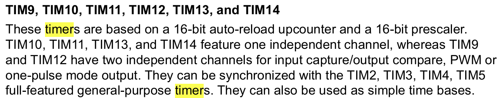

# Pin Assignments

| Function | Pin | Configuration |
|----------|-----|---------------|
| Potentiometer (ADC Input) | PA4 | ADC3_IN15 (Analog Input) |
| LED 1 (Software PWM) | PB0 | GPIO Output (Push-Pull) |
| LED 3 (Hardware PWM) | PB0 | TIM12_CH1 (Alternate Function) |
| UART TX (Debug) | PD8 | USART3_TX |
| UART RX (Debug) | PD9 | USART3_RX |

---

# ADC Implementation

### ADC3 Configuration

```c
hadc3.Instance = ADC3;
hadc3.Init.ClockPrescaler = ADC_CLOCK_SYNC_PCLK_DIV4;
hadc3.Init.Resolution = ADC_RESOLUTION_12B;
hadc3.Init.ContinuousConvMode = DISABLE;
hadc3.Init.DataAlign = ADC_DATAALIGN_RIGHT;
```

### Key Characteristic
- **12-bit resolution** provides 4096 discrete levels (0-4095)

### Polling Conversion
- **Polling-based:** `HAL_ADC_PollForConversion(&hadc3, 100)`
- **Why polling instead of interrupts?**
  - Main loop already blocks on delays (especially in SW_PWM mode)
  - DMA would be overkill for a single channel

### ADC Reading Process

```c
HAL_ADC_Start(&hadc3);                          // Start conversion
HAL_ADC_PollForConversion(&hadc3, 100);         // Wait max 100ms
adc_res = HAL_ADC_GetValue(&hadc3);             // Read 12-bit value (0-4095)
```

---

# Software PWM Implementation

### Concept

Software PWM toggles a GPIO pin using CPU-controlled delays to create a periodic waveform with variable duty cycle.

### Implementation

```c
adc_res_ten = (adc_res * 10) / 4096;                    // Map to 0-10 range
HAL_GPIO_WritePin(LD1_GPIO_Port, LD1_Pin, GPIO_PIN_SET);
HAL_Delay(adc_res_ten);                               // ON time
HAL_GPIO_WritePin(LD1_GPIO_Port, LD1_Pin, GPIO_PIN_RESET);
HAL_Delay(10 - adc_res_ten);                          // OFF time
```

### Resolution Problem

The expression `adc_res * 10 / 4096` has only **11 discrete brightness levels** (0-10)

### Limitations of Software PWM

| Issue | Impact |
|-------|--------|
| **CPU blocking** | Entire CPU dedicated to creating PWM, can't run other tasks |
| **Timing jitter** | Interrupts and other HAL functions cause slight timing variations |

#### Timing Jitter
The variation in the timing of periodic events -> HAL_Delay() gives u different result everytime <br>
`HAL_Delay()` function depends on SysTick interrupts firing every 1ms, there would be ISR overhead.

---

# Hardware PWM Implementation

## Timer 12 Configuration

Hardware PWM uses a dedicated timer peripheral to generate the PWM signal independently of the CPU.

```c
htim12.Instance = TIM12;
htim12.Init.Prescaler = 83;
htim12.Init.Period = 990;                    // ARR value
sConfigOC.Pulse = 500;                       // CCR value (initial 50% duty)
```
## Registers
### ARR (Auto-Reload Register)
Tells the counter when to STOP and reset to 0 <br>
Bigger ARR = counts higher before resetting = slower PWM
Smaller ARR = resets sooner = faster PWM

### CCR (Capture/Compare Register)
Tells the timer when to toggle the output pin <br>
**The rule for PWM:**
- When counter is **below CCR** → LED is **ON** (HIGH)
- When counter is **above or equal to CCR** → LED is **OFF** (LOW)

### 
### Clock Tree Analysis

**PWM Frequency**
- Period (ARR) = 990
- Counter counts from 0 to 990, then resets (991 total counts)
- **PWM Frequency = 1 MHz / 991 = 1.009 kHz ≈ 1 kHz**

### PWM Mode Operation

**TIM_OCMODE_PWM1 Behavior:**
- Output is **HIGH** when Counter < CCR (Compare value)
- Output is **LOW** when Counter ≥ CCR

**Example with CCR = 500:**
```
Counter:  0 ──────▶ 500 ──────▶ 990 ─┐
                                      └──▶ 0 (reset)
Output:   HIGH──────┘   LOW────────────┘
          
Duty Cycle = 500/990 = 50.5%
```

### Duty Cycle Control

The code maps the 12-bit ADC value to the timer compare register:

```c
uint16_t compare_value = (adc_res * 990) / 4096;
LD3_setDuty(compare_value);
```

**Critical Implementation Detail:**
- **Multiply BEFORE divide:** `(adc_res * 990) / 4096` ✓
- **WRONG approach:** `adc_res / 4096 * 990` ✗ (integer truncation gives 0!)

**Mapping:**
- ADC = 0 → CCR = 0 → 0% duty (LED off)
- ADC = 2048 → CCR = 495 → 50% duty (half brightness)
- ADC = 4095 → CCR = 989 → 99.9% duty (full brightness)

### Resolution Analysis

**Software PWM:**
- 11 discrete brightness levels
- Step size = 409 ADC counts

**Hardware PWM:**
- 991 discrete brightness levels (theoretical)
- Step size = 4.13 ADC counts
- **90× better resolution!**

In practice, the human eye can distinguish ~50-100 brightness levels, so HW PWM provides imperceptible steps.

---
# Impact of UART printing on SW vs HW
